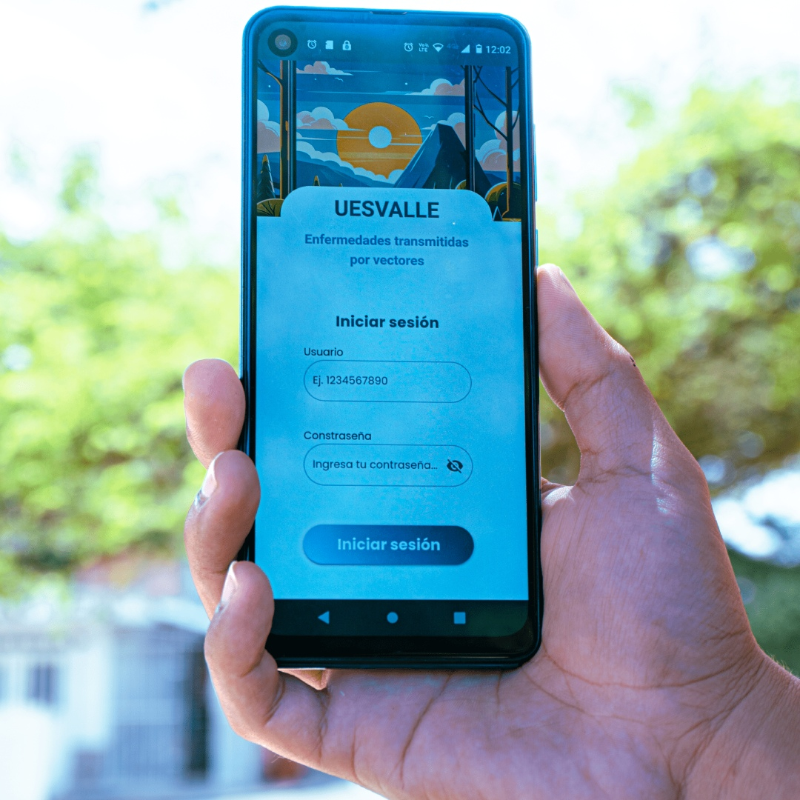

  

Aplicación android contruida con:

    
    
    

Hola y bienvenidos, a continuación, los guiare para que puedan poner en marcha esta app y puedan probarla

## Descripción

Esta aplicación fue diseñada para ejecutarse en dispositivos Android, la aplicación se encarga de capturar datos por medio de formularios, en este caso se basa en el proceso de Enfermedades Transmitidas por Vectores (ETV).
El programa se ejecuta en modo offline con el fin de poder realizar las labores de encuesta en cualquier lugar sin tener que depender del acceso a internet para este fin. Los datos recolectados son almacenados en una base de datos alojada en el dispositivo Android tipo SQLite.

Una vez terminada la jornada laboral y que el censista se encuentre en una zona con cobertura de internet, será momento de hacer la sincronización con el servidor central, en este proceso se envía toda la información almacenada en la base de datos del dispositivo móvil mediate una apiREST.

El servidor validará la petición por medio de usuario y contraseña, tomará los datos y devolverá como respuesta el id de las inserciones exitosas y las no exitosas.

La app tomará estos id para pasar las transacciones exitosas a una tabla log y las no exitosas quedarán disponibles para un nuevo envío e informará al usuario sobre esto.

Espero les guste.

Estaré subiendo nuevas funcionalidades constantemente.

## Funcionalidades Principales

- **Gestión de Usuarios:** Permite la autenticación y de usuarios.
  
- **Sincronización pull:** Realiza una petición al servidor para actualizar las tablas de municipios, barrios entre otros.

- **Sincronización push:** Realiza una petición al servidor para almacenar la información de las encuestas

- **Modo oscuro:** Permite habilitar el modo oscuro desde la app o desde el panel de notificaciones de Android

- **Funcion compartir encuestas (Nuevo!!):** Permite compartir las encuestas realizadas con WhatsApp o con cualquier otra app

> **Nota:** La validación del usuario en el login se a simplificado para efectos prácticos.

    Te invito a que mires como poner en marcha el proyecto.
    

